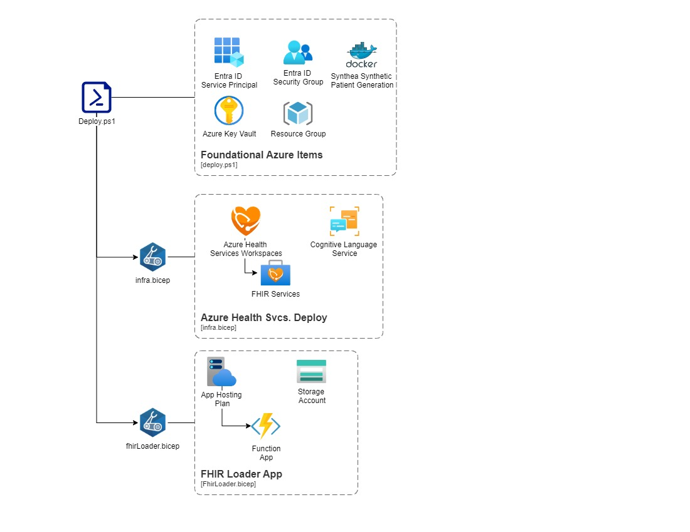

# Microsoft Fabric Health Data Solutions Foundation Deployment

This script is used to deploy the entire HDS E2E solution. It creates the necessary resources in Azure, including the FHIR Service, Azure Key Vault, Service Principal, and FHIR Loader Function App Service. It also generates synthetic data using Synthea and sends it to the Azure Storage Account for the FHIR Loader to process. The fhir-loader app sends the generated Synthea data to your new FHIR Service.


## Prerequisites

Before running this script, make sure you have the following tools installed. I created a simple [./prereqs.ps1](prereqs.ps1) script in this repo to assist you in this.

- Azure PowerShell module
- Docker
- Azure CLI
- AzCopy
- Git

## Deployment Steps



1. Run `.\prereqs.ps1` to ensure all necessary tools are installed.
2. Set the deployment variables in the script:
    - `$svcNamingPrefix`: The prefix for naming the resources.
    - `$fhirAdminEntraGrpName`: The name of the FHIR Service Group.
    - `$spnName`: The name of the Service Principal.
    - `$resourceGroupName`: The name of the resource group.
    - `$akvName`: The name of the Azure Key Vault.
    - `$location`: The Azure region where the resources will be deployed.
3. Run the script [`deploy.ps1`](./deploy.ps1).
4. Wait for the deployment to complete.
5. Check the output for the FHIR Service URI and Azure Key Vault Name.

## Automated Synthea Synthetic Data Creation and FHIR Service Population

1. Synthea runs to generate synthetic data using the command automatically. However, you can adjust these parameters include -p parameter that will generate the number of FHIR patients you desire:
    ```
    docker run --rm -v $PWD/output:/output --name synthea-docker intersystemsdc/irisdemo-base-synthea:version-1.3.4 -p 10 -s $(Get-Random) Tennessee Nashville --exporter.fhir.export=true --exporter.hospital.fhir.export=false --exporter.practitioner.fhir.export=false
    ```
2. The script sends the synthetic data to the Azure Storage Account for the FHIR Loader to process.

## FHIR Loader Azure Deployment

1. Uncomment the cloning of the fhir-loader repository if you'd like to use the out-of-box fhir-loader repo found [here.]([https://](https://github.com/microsoft/fhir-loader/tree/main))
2. The fhir-loader will auto-process, chunk, and send the FHIR .json files to the Azure FHIR Service
   1. If you'd like to see the synthetic patients that successfully copy up to Azure for insertion into your new FHIR Service, you can look at the `.\output\success` directory or look at the Azure Storage Account in Azure.
   2. Check the fhir-loader repo for advanced logging if desired.

## Contributing

Contributions are welcome! Please submit a pull request with any improvements or bu